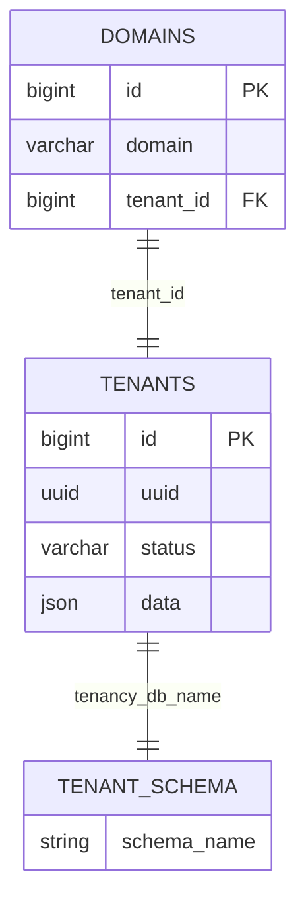
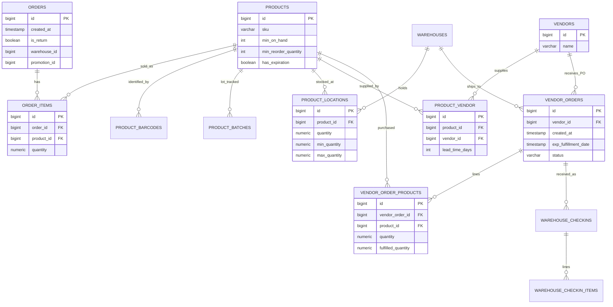

# Wecomm Database Architecture — Reorder AI Audit

**Date:** 2026-07-30  
**Source:** Live Azure Postgres via SSH tunnel (`127.0.0.1:5433`)  
**Master DB:** `postgres`  
**Focus tenant UUID:** `019fafca-fa67-7393-84c4-4ec423f88c15`  
**Focus tenant schema:** `wecomm_019fafca-fa67-7393-84c4-4ec423f88c15`  
**Secondary tenant schema:** `wecomm_019fb2f7-9d49-7032-bfe9-e20094fa15aa`

> This document does **not** include secrets (tenant DB usernames/passwords are omitted).

---

## 1. Critical architecture finding

### What was expected
Separate **physical databases** per tenant (e.g. DB name `wecomm_<uuid>`).

### What actually exists
**Single physical database** `postgres` with **schema-per-tenant**:

| Layer | Reality |
|------|---------|
| Physical DBs | `postgres` (+ Azure system DBs only) |
| Master | schema `public` |
| Tenant Paul | schema `wecomm_019fafca-fa67-7393-84c4-4ec423f88c15` |
| Tenant QA | schema `wecomm_019fb2f7-9d49-7032-bfe9-e20094fa15aa` |

`tenants.data.tenancy_db_name` stores the **schema name**, not a separate database.

**Implication for Reorder AI:** tenant switching = set `search_path` / fully-qualify `"schema".table`, **not** open a new DB connection by database name.

---

## 2. Tenant architecture (A)

### 2.1 Master tables

#### `public.tenants`
| Column | Type | Notes |
|--------|------|-------|
| `id` | bigint PK | Numeric tenant id used by `domains.tenant_id` |
| `uuid` | uuid | External tenant UUID (matches schema suffix) |
| `plan_id` | bigint | Plan FK |
| `status` | varchar | Tenant status |
| `email` | varchar | Contact email |
| `data` | json/jsonb | Includes `name`, `email`, `tenancy_db_name`, credentials (ignore secrets) |
| `created_at` / `updated_at` / `deleted_at` | timestamps | Soft delete supported |

Observed tenants: **2 rows**.

#### `public.domains`
| Column | Type | Notes |
|--------|------|-------|
| `id` | bigint PK | |
| `domain` | varchar | Hostname |
| `tenant_id` | bigint FK → `tenants.id` | |
| `created_at` / `updated_at` | timestamps | |

Observed:

| domain | tenant_id |
|--------|-----------|
| `paul.swadeshfoodmart.com` | 1 |
| `qa.swadeshfoodmart.com` | 2 |

### 2.2 Tenant creation / switching flow

```text
HTTP Host: paul.swadeshfoodmart.com
        │
        ▼
public.domains  (domain → tenant_id=1)
        │
        ▼
public.tenants  (id=1, uuid=019fafca-..., data.tenancy_db_name=wecomm_019fafca-...)
        │
        ▼
SET search_path TO "wecomm_019fafca-...", public;
   or query "wecomm_019fafca-..."."<table>"
        │
        ▼
Tenant business tables (orders, products, vendors, …)
```

### 2.3 ERD — master routing



---

## 3. Tenant schema inventory (B)

Each tenant schema has **~120 tables** (identical structure across Paul & QA).

Classification counts (Paul tenant):

| Class | Count |
|-------|------:|
| REQUIRED for Reorder AI | 9 (+ `product_vendor` should be treated as required; named singular) |
| POTENTIALLY USEFUL | 76 |
| NOT REQUIRED | 35 |

### 3.1 Core Reorder ERD (tenant)



---

## 4. Table documentation — REQUIRED (Reorder AI)

Schema prefix below = tenant schema (example Paul).

### 4.1 Sales demand

#### `orders`
- **Purpose:** Sales / POS order headers (demand event time).
- **PK:** `id`
- **Key columns:** `created_at`, `status`, `is_return`, `warehouse_id`, `promotion_id`, `discount_*`, `pos_register_*`, `deleted_at`
- **FKs:** warehouse, promotion, discount, customer, pos register, parent/return orders
- **AI use:** date spine for demand; filter out returns / deleted / cancelled statuses

#### `order_items`
- **Purpose:** Units sold per product per order (core demand signal).
- **PK:** `id`
- **Key columns:** `order_id`, `product_id`, `quantity`, `fulfilled_quantity`, `returned_quantity`, `price`, `discount_*`, `deleted_at`
- **FKs:** → `orders.id`, `products.id`
- **AI use:** daily demand = sum(`quantity`) by `product_id` + order date  
  Prefer net demand: `quantity - returned_quantity` (or exclude return orders)

### 4.2 Product master

#### `products`
- **Purpose:** Product master.
- **PK:** `id`
- **Key columns:** `sku`, `name`, `category_id`, `is_active`, `deleted_at`, `min_on_hand`, `min_reorder_quantity`, `backorder_quantity`, `has_expiration`, `batch_tracking`, UOM fields, `purchase_price`, `price`
- **AI use:** SKU universe; business min/ROP floors; expiry/batch flags; pack/UOM

#### `product_barcodes`
- **Purpose:** UPC/barcode ↔ product map.
- **PK:** `id`
- **Key columns:** `product_id`, `barcode`, `type`
- **AI use:** join external POS/UPC feeds to internal `product_id` (~6102 rows on Paul)

#### `product_batches`
- **Purpose:** Lot / expiry / remaining qty.
- **PK:** `id`
- **Key columns:** `product_id`, `expiration_date`, `starting_quantity`, `remaining_quantity`, `checkin_at`, `warehouse_id`, `product_location_id`
- **AI use:** waste-aware / expiry-capped ordering (Step 5)  
- **Data note:** currently **0 rows** on Paul tenant

### 4.3 Inventory

#### `product_locations`
- **Purpose:** On-hand stock by warehouse/location + min/max.
- **PK:** `id`
- **Key columns:** `product_id`, `warehouse_id`, `quantity`, `min_quantity`, `max_quantity`, `replenishment_priority`, `location_type`, `deleted_at`
- **AI use:** **available stock**; optional min/max caps; warehouse-scoped reorder  
- **Data note:** currently sparse (~1 row) on Paul — production readiness risk

### 4.4 Vendors / purchasing

#### `vendors`
- **Purpose:** Supplier master.
- **PK:** `id`
- **Key columns:** `name`, `vendor_type`, contact fields, `deleted_at`

#### `product_vendor`  (note: singular — not `product_vendors`)
- **Purpose:** Product↔vendor link with **lead time** and vendor price.
- **PK:** `id`
- **Key columns:** `product_id`, `vendor_id`, `price`, `lead_time_days`, `product_unit_measurement_id`
- **AI use:** **primary lead-time source** for ROP / cover window  
- **Data note:** currently **0 rows** — lead time may need fallback from PO→checkin history or config

#### `vendor_orders`
- **Purpose:** Purchase order headers.
- **PK:** `id`
- **Key columns:** `vendor_id`, `status`, `created_at`, `exp_fulfillment_date`, `po_number`, `warehouse_id`, `is_confirmed`, `is_approved`
- **AI use:** PO timing for empirical lead time; open inbound supply

#### `vendor_order_products`
- **Purpose:** PO lines.
- **PK:** `id`
- **Key columns:** `vendor_order_id`, `product_id`, `quantity`, `fulfilled_quantity`, `rejected_quantity`, UOM fields
- **AI use:** ordered vs received qty; vendor reliability / fill rate

---

## 5. POTENTIALLY USEFUL tables (improve accuracy)

### Inventory / warehouse ops
| Table | Why useful |
|------|------------|
| `warehouses` | Scope AI by store/warehouse |
| `warehouse_locations` | Location-level stock / replenishment |
| `warehouse_checkins` | Actual receive timestamps (true lead time) |
| `warehouse_checkin_items` | Received qty + `product_expiration` |
| `warehouse_replenishments` / `warehouse_replenishment_items` | Internal transfer demand |
| `inventory_counts` / `inventory_count_*` | Cycle count truth for stock quality |
| `inventory_disposals` / `inventory_disposal_products` | Waste/shrink labels |
| `product_location_histories` | Stock trajectory features |
| `expiring_product_batches` | Near-expiry watchlist |
| `replenishment_suggestions` | Existing system suggestions to compare vs AI |

### Demand / pricing / promo
| Table | Why useful |
|------|------------|
| `promotions` / `promotion_redemptions` | Promo uplift features |
| `discounts` | Discount effects |
| `product_price_histories` | Price elasticity (~3051 rows) |
| `pos_register_orders` / `pos_register_order_items` | Alternate/raw POS stream (validate vs `orders`) |
| `order_modifications` / `order_modification_items` | Demand quality / voids |

### Product attributes / UOM
| Table | Why useful |
|------|------------|
| `categories` | Category-level pooling / uplift |
| `unit_of_measurements` / `product_unit_measurements` | Pack size / case conversion |
| `vendor_products` | Alternate vendor-product mapping (sparse) |
| `product_vendor_histories` | Lead-time/price change history |

---

## 6. NOT REQUIRED (ignore for Reorder AI v1)

Examples (full list in `outputs/db_audit/*_table_docs.json`):

- Auth: `users`, `roles`, `permissions`, `sessions`, `personal_access_tokens`
- Jobs: `jobs`, `failed_jobs`
- UI/media: `product_images`, signatures, comments, kiosk helpers
- Accounting templates, notification settings
- Master `public` ops tables except `tenants` + `domains`

---

## 7. Reorder AI data mapping (C)

### 7.1 Feature availability checklist

| Need | Exists? | Source fields |
|------|---------|---------------|
| Historical sales qty | **Yes** | `order_items.quantity` + `orders.created_at` |
| Sales frequency / intermittency | **Yes** (derivable) | daily nonzero demand series |
| Seasonality / dow trends | **Yes** (derivable) | from order timestamps |
| Returns / cancellations | **Partial** | `orders.is_return`, `returned_quantity`, statuses |
| Promotions | **Schema yes / data sparse** | `promotions`, `orders.promotion_id` |
| Price changes | **Yes** | `product_price_histories` |
| Current stock | **Yes** | `product_locations.quantity` |
| Min / max stock | **Yes** | `product_locations.min_quantity/max_quantity`, `products.min_on_hand` |
| Incoming stock | **Partial** | open `vendor_orders` + unreceived lines / checkins |
| Expiry | **Schema yes / data empty** | `product_batches.expiration_date` |
| Vendor lead time | **Schema yes / data empty** | `product_vendor.lead_time_days` |
| Empirical lead time | **Possible** | `vendor_orders.created_at` → `warehouse_checkins.created_at` |
| Pack / UOM | **Yes** | UOM tables + product UOM FKs |
| Vendor reliability | **Possible** | fulfilled vs ordered vs rejected |

### 7.2 Calculation field map (W-1)

| Calculation | Required fields |
|-------------|-----------------|
| Demand forecast (X days) | daily demand from `orders`×`order_items`; optional promo/price features |
| Lead time L | `product_vendor.lead_time_days` else median(PO→checkin) else config default |
| Cover C | API/UI input (not a DB column) |
| Available stock | sum(`product_locations.quantity`) by product (+ warehouse filter) |
| Projected stock at arrival | available − demand over L |
| Safety / P90 sizing | from forecast store (batch), not raw SQL |
| ROP / order qty | P90(L+C) − available (+ expiry/box rules) |
| Box / MOQ | UOM/`min_reorder_quantity` |
| Expiry cap | `product_batches.expiration_date` + remaining qty |

### 7.3 Recommended joins for the pipeline

```sql
-- Daily demand (conceptual)
SELECT
  oi.product_id,
  DATE(o.created_at) AS sale_date,
  SUM(oi.quantity - COALESCE(oi.returned_quantity, 0)) AS units
FROM "{tenant}".order_items oi
JOIN "{tenant}".orders o ON o.id = oi.order_id
WHERE o.deleted_at IS NULL
  AND oi.deleted_at IS NULL
  AND COALESCE(o.is_return, false) = false
  -- AND o.status IN (...)  -- confirm production statuses
GROUP BY 1, 2;

-- On-hand
SELECT product_id, warehouse_id, SUM(quantity) AS on_hand
FROM "{tenant}".product_locations
WHERE deleted_at IS NULL
GROUP BY 1, 2;

-- Vendor lead time
SELECT product_id, vendor_id, lead_time_days, price
FROM "{tenant}".product_vendor;
```

---

## 8. Final Reorder AI Data Model

### 8.1 Mandatory tables
1. `orders`  
2. `order_items`  
3. `products`  
4. `product_barcodes`  
5. `product_locations`  
6. `vendors`  
7. `product_vendor`  
8. `vendor_orders`  
9. `vendor_order_products`  

### 8.2 Optional (accuracy / Step-5 enrichment)
- `product_batches`, `warehouse_checkins`, `warehouse_checkin_items`
- `warehouses`, `warehouse_locations`
- `promotions`, `discounts`, `product_price_histories`
- `unit_of_measurements`, `product_unit_measurements`, `categories`
- `inventory_disposals*`, `product_location_histories`
- `pos_register_orders*` (validation only until confirmed as system-of-record)

### 8.3 Ignore
Auth, jobs, notifications, UI/media, most accounting/permission tables.

### 8.4 Missing / weak for production AI (Paul tenant snapshot)

| Gap | Evidence | Risk |
|-----|----------|------|
| Thin sales history | ~1 order / ~20 order_items | Cannot train robust forecasts yet |
| Empty batches / checkins | 0 rows | Expiry + empirical lead time blocked |
| Empty `product_vendor` | 0 rows | No lead_time_days populated |
| Sparse `product_locations` | ~1 row vs ~3051 products | Stock unknown for most SKUs |
| Promo tables empty | 0 promotions | Uplift Phase 2 blocked |

**Catalog side is rich** (`products` ~3051, barcodes ~6102, price history ~3051). **Transactional inventory/sales side is not yet filled** in this tenant snapshot.

### 8.5 Recommended relationships (consume path)

```text
Domain → tenants/domains (public)
     → tenant schema
        products ← product_barcodes
        products ← order_items ← orders          (demand)
        products ← product_locations ← warehouses (stock)
        products ← product_vendor → vendors       (lead time)
        vendors  ← vendor_orders ← vendor_order_products
                 ← warehouse_checkins (receive truth)
        products ← product_batches (expiry)
```

### 8.6 Reorder AI runtime design (data plane only)

1. Resolve tenant schema from domain / tenant_id.  
2. Nightly batch reads mandatory (+ optional) tables from that schema.  
3. Build daily demand panel + stock snapshot + vendor lead times.  
4. Write forecasts to `forecast_store` (new table; does not exist yet).  
5. Detect-order API reads forecast_store + live `product_locations` + vendor/expiry rules.

---

## 9. Next steps (no ML yet)

1. Confirm: **schema-per-tenant** is intentional (vs separate DBs).  
2. Confirm which order statuses count as sold demand.  
3. Confirm system-of-record for POS: `orders` vs `pos_register_orders`.  
4. Backfill / integrate: stock (`product_locations`), vendor lead times (`product_vendor`), receives (`warehouse_checkins`).  
5. Only then implement detect-order live SQL + forecast batch against this model.

---

## 10. Artifact index

| File | Contents |
|------|----------|
| `outputs/db_audit/full_audit.json` | Full machine-readable audit |
| `outputs/db_audit/public_*.csv` | Master schema inventory |
| `outputs/db_audit/wecomm_019fafca_*` | Paul tenant inventory |
| `outputs/db_audit/sample_*.csv` | Sample rows for core tables |
| `outputs/db_audit/tenants_safe.json` | Tenants without secrets |
| `outputs/db_audit/domains.csv` | Domain → tenant map |
